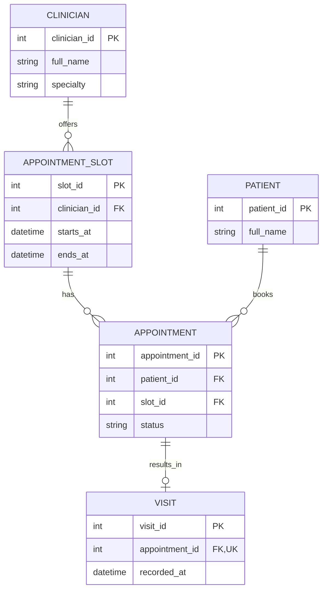

# Clinic ER Diagram

```mermaid
erDiagram
    CLINICIAN ||--o{ APPOINTMENT_SLOT : offers
    APPOINTMENT_SLOT ||--o{ APPOINTMENT : has
    PATIENT ||--o{ APPOINTMENT : books
    APPOINTMENT ||--o| VISIT : results_in

    CLINICIAN {
        int clinician_id PK
        string full_name
        string specialty
    }
    APPOINTMENT_SLOT {
        int slot_id PK
        int clinician_id FK
        datetime starts_at
        datetime ends_at
    }
    PATIENT {
        int patient_id PK
        string full_name
    }
    APPOINTMENT {
        int appointment_id PK
        int patient_id FK
        int slot_id FK
        string status
    }
    VISIT {
        int visit_id PK
        int appointment_id FK, UK
        datetime recorded_at
    }
```

- A slot can have several bookings in its history, with at most one uncancelled booking.
- Only a completed appointment can have a visit, and it can have at most one.